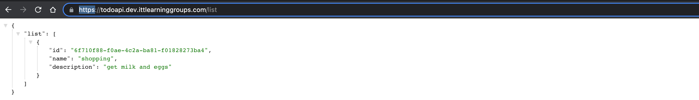
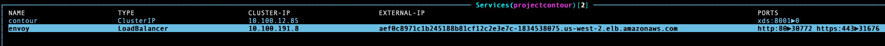
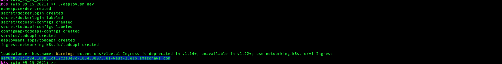
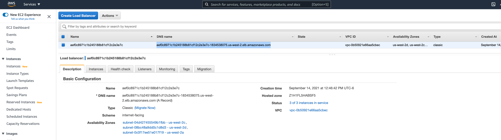
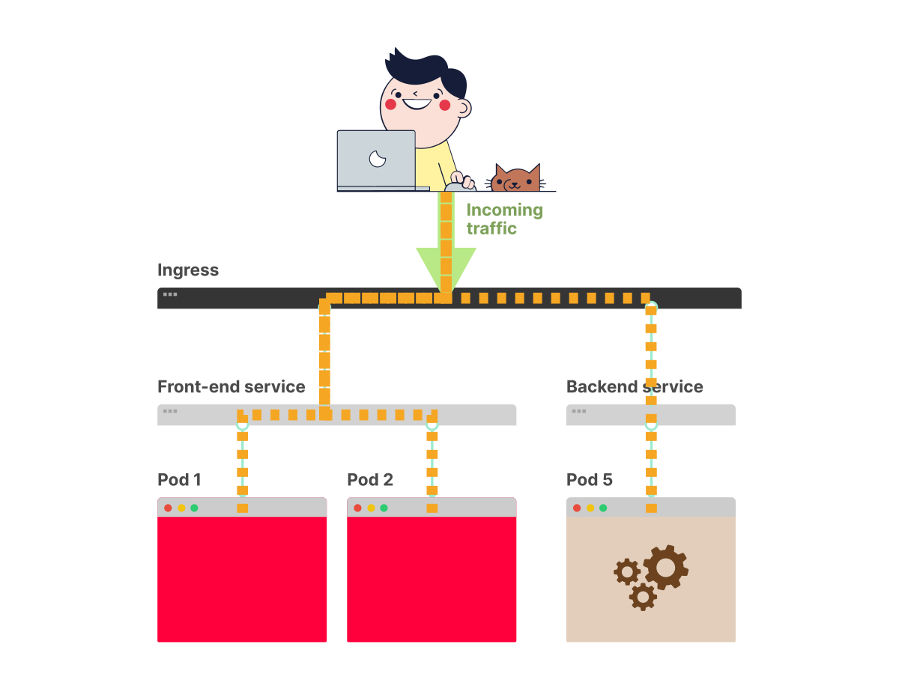
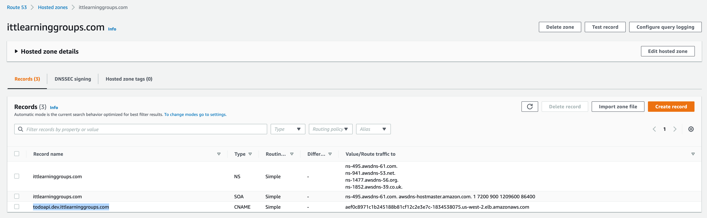
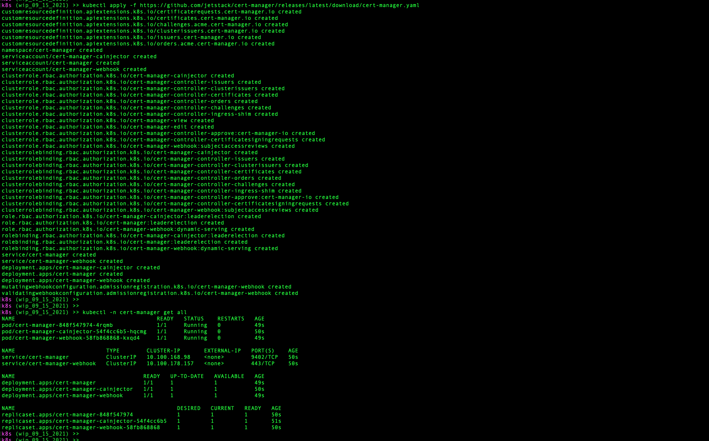
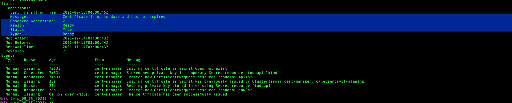

# Kubernetes "Demo": Ingress - part 2

## Goals

* Review and better understand the `ingress` concept
* Use our ingress controller to apply TLS to the `todoapi` endpoints

  

## Lab

### 1. Setup

* Check out [the sept15demo](https://github.com/us-learn-and-devops/todoapi/tree/sept15demo) branch of the `todoapi` repo in us-learn-and-devops GitHub.

        git fetch --all
        git checkout sept15demo

* ***Before*** running the `/build/cluster-deploy.sh` script (or equivalent) to get your k8s cluster up and running, check that the worker node type has been upgraded from `t3.micro` to `t3.small`.
  Alternatively, you could keep the `t3.micro` type and increase the number of worker nodes (via the `--nodes` and `--nodes-max` options in the `eksctl create cluster` command) to >= 5.

  (*[Here](https://learnk8s.io/kubernetes-node-size) is some advice on which strategy to choose if you face this sort of choice in real life.*)

  Recall that different worker node types come with different pod limits. For AWS EC2 instances, [this doc](https://github.com/awslabs/amazon-eks-ami/blob/master/files/eni-max-pods.txt) gives a breakdown by instance type.(The pod limit is imposed by the cluster networking plugin that AWS EKS uses, unless you customize it and install a non-default plugin: It's responsible for issuing a network interface for each pod the k8s API server creates on a worker node, so it gets to stipulate how many it will issue per worker node depending on the size and type of node instance.)

  For `t3.micro` instances, the pod limit is 4.
  We ran into this limit once before, where we found that with a 3-node cluster, we were capped at 12 pods total, including kube-system pods.

  By the end of today's demo exercise, you'll have at least 17 pods in your cluster; more if you deploy more than one environment or increase the `todoapi` deployment replica count for any environment:

  

  The `t3.small` instance has a pod limit of 11, so with 3 of these worker nodes, you'll have plenty of space.

* Like last time, to deploy a starting version of the `todoapi` to one or more of the environments (dev, qa, or prod), you'll need the DB username and password for the cloud MongoDB servers unless you've created your own.

* You'll need to have chosen and applied a strategy (among those discussed last time) for securely creating the DB username/password secret and docker-registry secret in the `build/k8s/deploy.sh` file for each deploy environment.

* Finally, you'll need to make sure your cluster has an Ingress controller installed.
  For this demo/exercise, we're using the [Contour](https://projectcontour.io/) Ingress controller.
  You can install it as shown in part 5 of the lab write-up for our last session: Run `kubectl apply -f https://j.hept.io/contour-deployment-rbac` or add this command to the end of your `build/cluster-destroy.sh` script before you run it.

  Feel free to use a different Ingress controller if you like. Any of the popular ones should work, but note that...

  * The Ingress resource configs shown below will be specific for Contour. If you use a different Ingress controller, the resource configs will probably be similar, but not the same. You'll probably have to do some research to figure out how to correctly configure these.
  * I've only tested the lab 100% using Contour (as well as part of the way using the AWS ALB Ingress controller). So you may run into issues that I haven't anticipated.

### 2. Ingress Controller: Review & Discussion

Notice that when you install the Contour Ingress controller, a lot of "stuff" gets added to the cluster:

    namespace/projectcontour created
    serviceaccount/contour created
    serviceaccount/envoy created
    configmap/contour created
    customresourcedefinition.apiextensions.k8s.io/extensionservices.projectcontour.io created
    customresourcedefinition.apiextensions.k8s.io/httpproxies.projectcontour.io created
    customresourcedefinition.apiextensions.k8s.io/tlscertificatedelegations.projectcontour.io created
    serviceaccount/contour-certgen created
    rolebinding.rbac.authorization.k8s.io/contour created
    role.rbac.authorization.k8s.io/contour-certgen created
    job.batch/contour-certgen-v1.18.1 created
    clusterrolebinding.rbac.authorization.k8s.io/contour created
    clusterrole.rbac.authorization.k8s.io/contour created
    service/contour created
    service/envoy created
    deployment.apps/contour created
    daemonset.apps/envoy created

Amongst these, the two Services are the most immediately of interest to us as Ingress controller users:

Deploy your `todoapi` to the `dev` environment using our collection of YAML manifestos in `/build/k8s` including the `ingress.yaml`, and you'll notice that the loadbalancer hostname reported (where you can `curl` todoapi endpoints or visit them in a browser) is the same as that Contour `envoy` Service's External-IP:

And if you check the list of load balancers in your AWS account, you'll find this same string appears as the `DNS name` of a "Classic" elastic load balancer there:

*You* didn't create this load balancer, so who did?

Not a trick question: The Service resource did. The `envoy` Service is listed as type "LoadBalancer".
We've already learned that a LoadBalancer-type Service will create a cloud load balancer behind the scenes that it uses to expose the pods matching the Service's selectors to consumers outside the cluster itself (such as browsers from the public internet).
If your cluster is configured correctly, its Service controller must be configured to be able to create and manage a cloud load balancer like this.
We used `eksctl` to easily configure our cluster on AWS, so we got this config set up for us automagically.

#### **Ingress vs Service**

What's novel about that envoy load balancer and the LoadBalancer Service we used for `todoapi` before installing an Ingress controller is that we got a ***new*** cloud load balancer for ***each*** `todoapi` Service we created.
When we deployed `todoapi` to each of our 3 ("dev", "qa", and "prod") deploy environments, we created a `todoapi` Service resource for each environment (each in its own namespace) -- and we got 3 cloud load balancers, one for each.

The Ingress controller is more sophisticated: It allows us to unite multiple pod Services under a ***single*** internet-facing load balancer, and to configure a rule-set to define how incoming requests should be routed to each Service.

(*Note that this picture is slightly misleading w.r.t. the implementation details, but that detail is not important to understand Ingress conceptually.*)

In Kubernetes, an Ingress is a component that routes the traffic from outside the cluster to your services and Pods inside the cluster.

In simple terms, the Ingress works as a reverse proxy: All external traffic is routed to the Ingress and then is routed to the appropriate k8s cluster components.

#### **Choices**

While the most popular Ingress is the [ingress-nginx](https://kubernetes.github.io/ingress-nginx/) project, there are several other options when it comes to selecting and using an Ingress.

Kubernetes as a project supports and maintains [AWS](https://github.com/kubernetes-sigs/aws-load-balancer-controller#readme) and [GCE](https://git.k8s.io/ingress-gce/README.md#readme) Ingress controllers.

You can choose from Ingress controllers that:

* handle HTTP traffic, such as [Contour](https://github.com/heptio/contour) or [Treafik](https://docs.traefik.io/user-guide/kubernetes/)
* support UDP and TCP traffic such as [Citrix Ingress](https://github.com/citrix/citrix-k8s-ingress-controller)
* support Websockets such as [HAProxy Ingress](https://github.com/jcmoraisjr/haproxy-ingress)
* support an API Gateway (such as [Kong](https://konghq.com/blog/kong-kubernetes-ingress-controller/) or [Ambassador](https://www.getambassador.io/))

If you're really curious, check out [this list](https://kubernetes.io/docs/concepts/services-networking/ingress-controllers/#additional-controllers) or [this handy comparison sheet](https://docs.google.com/spreadsheets/d/191WWNpjJ2za6-nbG4ZoUMXMpUK8KlCIosvQB0f-oq3k/edit#gid=907731238).

#### **Ingress *Resouce* vs *Controller***

When we work with Ingress as application developers, we principally do so via an [Ingress resource](https://kubernetes.io/docs/concepts/services-networking/ingress/#the-ingress-resource).
We create these to configure external access to our deployed Services.
But these resources, when created, will only tell an associated Ingress controller how to do its load-balancing work. They can't, on their own, create a load balancer or handle incoming traffic.

As the Kubernetes official docs on Ingress state in the [Prerequisites](https://kubernetes.io/docs/concepts/services-networking/ingress/#the-ingress-resource) section:

    You must have an Ingress controller to satisfy an Ingress. Only creating an Ingress resource has no effect.

Unlike all the other controllers we've used so far (whether we noticed or not), no Ingress controllers come packaged as part of the k8s cluster when you first set it up.
Ingress controllers are designed to be a plug-in add-on to you cluster.

So when we work with Ingress as cluster admins, we principally do so by selecting, installing, and maintaining one or more controllers from the choices noted above.

#### **Switching `todoapi` from Service-only to Service + Ingress**

Note that when we used a Service alone to provide external access to the `todoapi` pods, we designated that Service as a "LoadBalancer" service.

Now that we're using an Ingress for external access, we changed the Service to be of type "NodePort".

Based on what you know about k8s [Service types](https://git.k8s.io/ingress-gce/README.md#readme), why do you think we made this change?
[Here](https://medium.com/google-cloud/kubernetes-nodeport-vs-loadbalancer-vs-ingress-when-should-i-use-what-922f010849e0) is some more background material that might help.

The big downside to a NodePort Service is that it requires tracking individual node IPs.
This is a headache if we're managing access to the NodePort service ourselves.
However, if the Ingress controller is doing that *for us*, the downside disappears.

### 3. Adding a TLS cert to our Ingress controller (demo)

#### **Backgroud/Requirements**

* In order to generate a TLS certificate we can use to activate HTTPS-protected access to the `todoapi` Ingress, we'll need to generate a certificate signing request ("CSR") and send it to a certificate authority ("CA") to approve and create the certificate for us.
  Among the items needed to create a CSR is a "common name" and an optional list of "subject alternative names", which represent stable, DNS-routable hostnames for our `todoapi` server.

  In our case, the hostname for our `todoapi` server is the External-IP/DNS-Name of the load balancer maintained by our Ingress controller.
  This hostname is not particularly stable, however: It changes each time we redeploy the Ingress controller.
  We could use it to create a CSR, but we'd have to create a new CSR and generate a new TLS certificate every time we deployed our `todoapi` project.

  Instead, we'll first register a stable domain name and then use a CNAME record for that domain to make a stable `todoapi` subdomain for each deploy environment that "points" to the Ingress controller's load balancer.
  We'll still need to update those CNAME records when we redeploy the Ingress controller, but we won't have to regenerate a new TLS certificate.

  In my case, I'll register the domain `ittlearninggroups.com`, and create CNAME records for subdomains `todoapi.dev.ittlearninggroups.com`, `todoapi.qa.ittlearninggroups.com`, and `todoapi.prod.ittlearninggroups.com`.
  That way, I can use e.g. `todoapi.dev.ittlearninggroups.com` to create a TLS cert for `todoapi` in its dev namespace.

  You are free to create any domain and subdomain you like.
  If you're an AWS user, you can register painlessly via the Route53 service, which will also create a hosted zone for your domain once registration succeeds.
  An available domain will probably cost abou $10-12 to register for one year.

* There are lots of ways to generate and manage TLS certificates.
  We'll choose a pattern that is common in the k8s ecosystem: We'll install a certificate manager that will handle creating and fulfilling CSRs for us, as well as storing and managing certificates we receive.
  For our CA, we'll use the popular [Let's Encrypt](https://letsencrypt.org/docs/) server, since it's free and cloud-platform independent.
  * For our certificate manager, we'll install and use the [cert-manager](https://www.cncf.io/projects/cert-manager/) from the [Cloud Native Computing Foundation (CNCF) Sandbox](https://www.cncf.io/sandbox-projects/), which was developed by [Jetstack](https://jetstack.io/).
  * Check out the cert-manager docs [here](https://cert-manager.io/docs/), which includes a helpful [Concepts](https://cert-manager.io/docs/concepts/) section explaining how cert-manager integrates with your k8s cluster and [how it works](https://cert-manager.io/docs/concepts/certificate/#certificate-lifecycle).
  * Note that, in real life, you'd do well to consider an upgraded cert-manager solution.
    For our purposes, the free CNCF cert-manager will work fine.
    But it does store cert keys as secrets in a way that is accessible to entities with access to node memory.
    And it is your responsibility as a cluster admin to sensure that RBAC rules have been configured to restrict access to those underlying secrets.

    There is an enterprise version of cert-manager offered by Jetstack, and Jetstack offers a toolkit and training to help ensure that cluster admins are using it with best practices.
    There are also lots of alternatives.
    For example, AWS offers a robust way to integrate cert-manager with EKS and with the [AWS Certificate Manager Private Certificate Authority](https://aws.amazon.com/certificate-manager/private-certificate-authority/).
    See docs [here](https://aws.amazon.com/blogs/security/tls-enabled-kubernetes-clusters-with-acm-private-ca-and-amazon-eks-2/).

* Once we have cert-manager installed, we'll get access to two custom resources (CRDs) that it adds to our cluster's API server: The `Issuer` and `ClusterIssuer` resources.
  We'll use a `ClusterIssuer`, which is not [namespace-restricted](https://cert-manager.io/docs/concepts/issuer/#namespaces).
  
  We'll create a `ClusterIssuer` configured with the Let's Encrypt prod server as its certificate provider.

* With that in place, we can update our `todoapi` Ingress resource to use the issuer to create and apply a certificate.
  We can watch this certificate request get fulfilled, then visit e.g. `todoapi.dev.ittlearninggroups.com` in a browser to confirm that it uses HTTPS.

#### **Demo**

* Deploy `todoapi` in its current state (i.e. [the sept15demo](https://github.com/us-learn-and-devops/todoapi/tree/sept15demo) branch) in one (or more) deploy environment.
  * This should include deployment of the Contour Ingress controller for the cluster, and of the Ingress resource for the given deploy environment(s).
  * Grab the External-IP for the Ingress controller.

* Create domain and subdomain CNAME record(s) for `todoapi`.
  * Use the Ingress controller External-IP when creating CNAME record(s).

    

* Check that `todoapi` is reachable (e.g. via `curl` or via browser) using (one of those) CNAME record(s).

* Deploy the cert-manager, configured with the Let's Encrypt prod server, to your cluster.
  See [docs here](https://cert-manager.io/docs/installation/#default-static-install).

  We'll use the default static install, because we "don't require any tweaking of the cert-manager install parameters":

        kubectl apply -f https://github.com/jetstack/cert-manager/releases/download/v1.5.3/cert-manager.yaml

  or

        kubectl apply -f https://github.com/jetstack/cert-manager/releases/latest/download/cert-manager.yaml

  (Latest stable release is v1.5, but you can install v1.6 as "latest" and you'll be fine.)

* Check that cert-manager installed OK:

        kubectl -n cert-manager get all

  You should see something like this:

  

* Create a cert-manager `ClusterIssuer` resource that lists the Let's Encrypt prod server (<https://acme-v02.api.letsencrypt.org/directory>).
  * Create file `build/letsencrypt.yaml` with following contents:

        apiVersion: cert-manager.io/v1
        kind: ClusterIssuer
        metadata:
          name: letsencrypt
          namespace: cert-manager
        spec:
          acme:
            email: {your email address}
            privateKeySecretRef:
              name: letsencrypt
            server: https://acme-v02.api.letsencrypt.org/directory
            solvers:
              - http01:
                  ingress:
                    class: contour

    We create this in the cert-manager namespace that was created when we installed cert-manager.
    The ClusterIssuer will itself be namespace independent, meaning we can use it to create TLS certs in any namespace in our cluster.

    The "acme" key in the spec refers to the fact that Let’s Encrypt uses the [ACME protocol](https://cert-manager.io/docs/configuration/acme/) to verify that you control a given domain name and to issue you a certificate.
    To get a Let’s Encrypt certificate, you need to an ACME client.
    Our cert-manager is an ACME client, so we're covered, and we won't actually have to do anything to help cert-manager solve the verification challenge from Let's Encrypt.

    This manifest lists "HTTP01" as the solver method.
    This will be used by cert-manager behind the scenes to solve the issuer challenge. You can read more about HTTP01 and the alternative "DNS01" challenge type for ACME issuers [here](https://cert-manager.io/docs/configuration/acme/#solving-challenges).

  * Deploy the ClusterIssuer:
  
        kubectl apply -f letsencrypt.yaml

* Update your `todoapi` Ingress resource (for a given deploy environment) like this (resource for `todoapi.dev.ittlearninggroups.com` host shown; use your own subdomain hostname):

      apiVersion: networking.k8s.io/v1
      kind: Ingress
      metadata:
        name: todoapi
        labels:
          app: todoapi
        annotations:
          cert-manager.io/cluster-issuer: letsencrypt
          ingress.kubernetes.io/force-ssl-redirect: "true"
          kubernetes.io/ingress.class: contour
          kubernetes.io/tls-acme: "true"
      spec:
        tls:
          - secretName: todoapi
            hosts:
              - todoapi.dev.ittlearninggroups.com
        rules:
          - host: todoapi.dev.ittlearninggroups.com
            http:
              paths:
                - path: /
                  pathType: Prefix
                  backend:
                    service:
                      name: todoapi
                      port:
                        number: 80

  The annotations inform the API server how to create/update the Ingress resource:

  * Use the ClusterIssuer named "letsencrypt" to issue the TLS certificate configured in the `spec.tls` field.
  * Redirect incoming HTTP requests (port 80) to HTTPS (port 443).
  * Use the Contour Ingress controller.
  * Use the ACME protocol for the TLS certificate.

  We add the `tls` section to the Ingress spec to ensure that a k8s Secret will be created (behind the scenes) to hold our certificate data.
  Note that that Secret resource will get the name you supply on the `secretName` line; avoid using a name you're already using for a k8s Secret in the same namespace.
  A TLS Secret is one more of the half-dozen or so Secret types k8s makes available: It's a Secret type specifically designed to be used for TLS certs.

  * Deploy the resource update:

      kubectl apply -f ./ingress.yaml -n dev

* Wait for the certificate to be listed as "Ready":

      kubectl describe certificate todoapi -n dev

  

* Check that `todoapi` is reachable (e.g. via `curl` or via browser) ***via HTTPS*** using (one of those) CNAME record(s).

  
